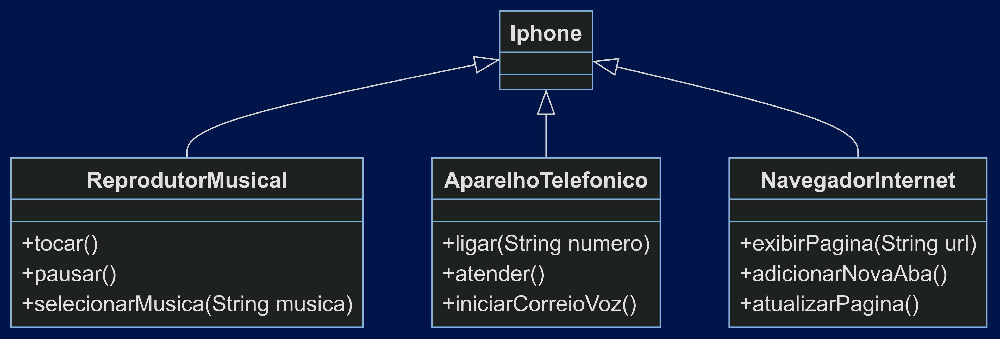

# DIO - Trilha Java Básico

## 1. POO - Desafio

Neste desafio, foi pedido para modelar e diagramar a representação UML do iPhone, abrangendo suas funcionalidades como Reprodutor Musical, Aparelho Telefônico e Navegador na Internet.

## 2. Funções que me baseei para fazer
### Reprodutor Musical 
* tocar() 
* pausar()
* selecionarMusica(String musica)

### Aparelho Telefônico
* ligar(String numero)
* atender() 
* iniciarCorreioVoz()

### Navegador na Internet
* exibirPagina(String url)
* adicionarNovaAba()
* atualizarPagina()

## 3. Diagrama em UML do Iphone

## 4. Programação 

Além do diagrama, utilizei o paradigma de orientação a objetos para fazer os códigos, baseados no modelo acima. 